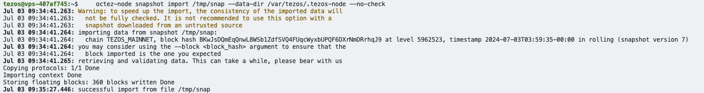
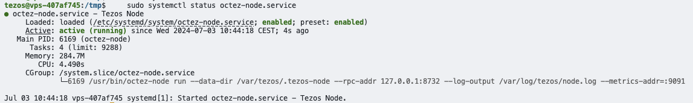

WIP Tezos Octez node setup and baking OVH x softstack x Tezos

This is the documentation for setting up a Tezos Baker/Validator node with a server from [OVH](https://www.ovh.com).

- [1. Prerequisites](#1-prerequisites)
  - [1.1 Hardware Setup](#11-hardware-setup)
  - [1.2 Buy OVH server](#12-buy-ovh-server)
- [2. Hardening the server](#2-hardening-the-server)
  - [2.1 Login to server](#21-login-to-server)
  - [2.2 Create new user with sudo privileges](#22-create-new-user-with-sudo-privileges)
  - [2.3 Disable SSH password Authentication and Use SSH Keys only](#23-disable-ssh-password-authentication-and-use-ssh-keys-only)
  - [2.4 Update your system](#24-update-your-system)
  - [2.5 Disable root account](#25-disable-root-account)
  - [2.6 Secure Shared Memory](#26-secure-shared-memory)
  - [2.7 Install Fail2ban](#27-install-fail2ban)
- [whitelisted IP addresses](#whitelisted-ip-addresses)
- [ignoreip = \<list of whitelisted IP address, your local daily laptop/pc\>](#ignoreip--list-of-whitelisted-ip-address-your-local-daily-laptoppc)
  - [2.8 Configure your Firewall](#28-configure-your-firewall)
  - [2.9 Verify Listening Ports](#29-verify-listening-ports)
- [3. Initial Setup](#3-initial-setup)
  - [3.1 Time Sync Check](#31-time-sync-check)

# 1. Prerequisites

## 1.1 Hardware Setup

- High CPU performance for transaction processing
- Sufficient memory to handle blockchain data and operations
- Fast and reliable storage with SSD
- Good network performance

In numbers:

- 8 GB RAM
- 2 CPU cores (better 4 vCPU)
- Min. 256 GB SSD Drive
- Linux (Docker optional)
- Network min. 100 Mbps

History types for a node:

- **Rolling mode:** The most lightweight mode. It stores recent blocks with their current context.
- **Full mode (default mode):** It also stores the content of every block since genesis so that it can handle requests about them, or even recompute the ledger state of every block of the chain.
- **Archive mode:** Also stores the history of the context, allowing services like indexers to enquire about balances or staking rights from any past block.

Network types:

- Mainnet
- Oxfordnet was a testnet. Seems to be deprecated.
- Ghostnet is a permanent testnet for devs or bakers.

The node is intended for baking with no need to store content of every previous block. This is why the history type can be in **rolling** mode. Network type must be **mainnet**.

## 1.2 Buy OVH server

1. Got to [ovh.com](https://www.ovh.com)

- Select _Virtual Private Server_.


2. Choose Comfort Server

- **8GB** RAM
- 4 vCPU
- 160GB SSD NVMe
- 1Gbps network connectivity


3. Configure VPS

- Choose **Debian 12** as Operating System (Latest Ubuntu 24.04 had a lot of problems).


- Choose datacentre


4. Check order summary

- Select **Payment up-front** to save costs.


5. Complete payment process


# 2. Hardening the server

## 2.1 Login to server

    ssh debian@server.public.ip.address

## 2.2 Create new user with sudo privileges

This creates a new user named tezos, sets the password and adds tezos user to sudo group:

    sudo useradd -m -s /bin/bash tezos
    sudo passwd tezos
    sudo usermod -aG sudo tezos


## 2.3 Disable SSH password Authentication and Use SSH Keys only

The basic rules of hardening SSH are:

- No password for SSH access (use private key)
- Don't allow root to SSH (the appropriate users should SSH in, then su or sudo)
- Use sudo for users so commands are logged
- Log unauthorized login attempts (and consider software to block/ban users who try to access your server too many times, like fail2ban)
- Lock down SSH to only the ip range your require (if you feel like it)

Create a new ssh key locally

    ssh-keygen -t ed25519 -f ~/.ssh/my_custom_key_name -C "comment or label for this key"

Transfer the public key to your remote node. Update keyname.pub appropriately.

    ssh-copy-id -i $HOME/.ssh/keyname.pub debian@server.public.ip.address

Login with your new ethereum user

    ssh tezos@server.public.ip.address

Disable root login and password based login. 

    Edit the /etc/ssh/sshd_config file
    sudo nano /etc/ssh/sshd_config

    Locate ChallengeResponseAuthentication and update to no
    ChallengeResponseAuthentication no

    Locate PasswordAuthentication update to no
    PasswordAuthentication no

    Locate PermitRootLogin and update to prohibit-password
    PermitRootLogin prohibit-password

    Locate PermitEmptyPasswords and update to no
    PermitEmptyPasswords no

Validate the syntax of your new SSH configuration.

    sudo sshd -t

If no errors with the syntax validation, restart the SSH process

    sudo systemctl restart sshd

## 2.4 Update your system
It's critically important to keep your system up-to-date with the latest patches to prevent intruders from accessing your system.

    sudo apt update -y && sudo apt dist-upgrade -y
    sudo apt autoremove
    sudo apt autoclean

Enable automatic updates so you don't have to manually install them.

    sudo apt install unattended-upgrades 
    sudo dpkg-reconfigure -plow unattended-upgrades

## 2.5 Disable root account
System admins should not frequently log in as root in order to maintain server security. Instead, you can use sudo execute that require low-level privileges.

To disable the root account, simply use the -l option.

    sudo passwd -l root
    
If for some valid reason you need to re-enable the account, simply use the -u option.

    sudo passwd -u root

## 2.6 Secure Shared Memory
One of the first things you should do is secure the shared memory used on the system. If you're unaware, shared memory can be used in an attack against a running service. Because of this, secure that portion of system memory.

Edit /etc/fstab

    sudo nano /etc/fstab

Insert the following line to the bottom of the file and save/close. This sets shared memory into read-only mode.

    tmpfs    /run/shm    tmpfs    ro,noexec,nosuid    0 0

Reboot the node in order for changes to take effect.

    sudo reboot

Check with this command. (ro, nosuid,noexec = read-only, no setuid, no execute)

    mount | grep /run/shm

## 2.7 Install Fail2ban
Fail2ban is an intrusion-prevention system that monitors log files and searches for particular patterns that correspond to a failed login attempt. If a certain number of failed logins are detected from a specific IP address (within a specified amount of time), fail2ban blocks access from that IP address.

    sudo apt-get install fail2ban -y

Edit a config file that monitors SSH logins.

    sudo nano /etc/fail2ban/jail.local

Add the following lines to the bottom of the file.
Whitelisting IP address tip: The ignoreip parameter accepts IP addresses, IP ranges or DNS hosts that you can specify to be allowed to connect. This is where you want to specify your local machine, local IP range or local domain, separated by spaces.


[sshd]
enabled = true
port = 22
filter = sshd
logpath = /var/log/auth.log
maxretry = 3
# whitelisted IP addresses
# ignoreip = <list of whitelisted IP address, your local daily laptop/pc>

Save/close file.
Restart fail2ban for settings to take effect.

    sudo systemctl restart fail2ban

## 2.8 Configure your Firewall
The standard UFW firewall can be used to control network access to your node. With any new installation, ufw is disabled by default. Enable it with the following settings.

    sudo apt install ufw

By default, deny all incoming and outgoing traffic

    sudo ufw default deny incoming
    sudo ufw default allow outgoing

Allow ssh access

    sudo ufw allow ssh 

Allow p2p ports

    sudo ufw allow 13000/tcp
    sudo ufw allow 12000/udp

Allow eth1 port

    sudo ufw allow 30303/tcp
    sudo ufw allow 30303/udp

Allow tezos node P2P and RPC connections
    
    sudo ufw allow 9732/tcp

Enable firewall

    sudo ufw enable

Check status

    sudo ufw status verbose

Might want to enable ufw logging 

    sudo ufw logging on

>**Note** It is dangerous to open 3000 / 9090 for Grafana or Prometheus on a VPS/cloud node.

## 2.9 Verify Listening Ports
If you want to maintain a secure server, you should validate the listening network ports every once in a while. This will provide you essential information about your network.

    sudo ss -tulpn or sudo netstat -tulpn


## 2.10 Time Sync Check
Run the following command:

    timedatectl 

✅ Check if NTP Service is active.
✅ Check if Local time, Time zone, and Universal time are all correct.
✅ If NTP Service is not active, run:

    sudo timedatectl set-ntp on 
    sudo timedatectl set-ntp true

    sudo timedatectl set-timezone Europe/Berlin


If you see error message Failed to set ntp: NTP not supported, you may need to install chrony or ntp package.

>**Note** by default, VMs may disable NTP so you may need to find a work-around for your environment.

# 3. Tezos Node Setup

## 3.1 Get octez packages

[Link](https://chrispinnock.com/tezos/node/)


    sudo apt update && sudo apt upgrade
    sudo apt install libev4 libhidapi-libusb0 curl

Get octez node, octez client then octez baker and Install in that particular order

    curl -o octez-node.deb https://pkgbeta.tzinit.org/debian-12/octez-node_20.1-1_amd64.deb
    sudo dpkg -i octez-node.deb

    curl -o octez-client.deb https://pkgbeta.tzinit.org/debian-12/octez-client_20.1-1_amd64.deb
    sudo dpkg -i octez-client.deb

    curl -o octez-baker.deb https://pkgbeta.tzinit.org/debian-12/octez-baker_20.1-1_amd64.deb
    sudo dpkg -i octez-baker.deb

    sudo apt-get install -f

Create tezos folder and grant access to tezos user

    sudo mkdir -p /var/tezos
    sudo chown -R tezos:tezos /var/tezos
    sudo mkdir -p /var/log/tezos
    sudo chown -R tezos:tezos /var/log/tezos
    sudo chmod +x /usr/bin/octez-node

Init configuration

    octez-node config init --data-dir /var/tezos/.tezos-node \
        --network=mainnet \
        --history-mode=rolling \
        --net-addr="[::]:9732" \
        --rpc-addr="127.0.0.1:8732" \
        --metrics-addr="127.0.0.1:9091"

Edit configuration 

    cat /var/tezos/.tezos-node/config.json

## 3.2 Get snapshot

    wget -O /tmp/snap https://snapshots.eu.tzinit.org/mainnet/rolling
    octez-node snapshot import /tmp/snap --data-dir /var/tezos/.tezos-node --no-check



    rm /tmp/snap

## 3.3 Start node on boot

Create a systemd service to enable that the node starts on boot

    sudo nano /etc/systemd/system/octez-node.service

Add this to the file.
```
[Unit]
Description=Tezos Node
Wants=network-online.target
After=network-online.target

[Service]
Type=simple
User=tezos
Group=tezos
ExecStart=/usr/bin/octez-node run --data-dir /var/tezos/.tezos-node --rpc-addr 127.0.0.1:8732 --log-output /var/log/tezos/node.log --metrics-addr=:9091
Restart=on-failure

[Install]
WantedBy=multi-user.target
```

Reload daemon service, enable new service and start it

    sudo systemctl daemon-reload
    sudo systemctl enable octez-node.service
    sudo systemctl start octez-node.service

Reload with

    sudo systemctl restart octez-node.service

Check status with

    sudo systemctl status octez-node.service



## 3.4 Check node logs

The node will now start to sync with the blockchain.

You can also monitor the progress of the sync with the network using below command. Ultimately it will say *Node is bootstrapped.*

    octez-client bootstrapped


You can now view the progress of the node in the log file. It will sync with the network and fill the gap from the point that the snapshot was taken to the current block. Then you will have a working Tezos node.

    tail -f /var/log/tezos/node.log
    journalctl -f -u octez-node.service -b

# 4. Tezos Client Setup

## 4.1 Set base directory

    sudo mkdir -p /var/tezos/.tezos-client
    sudo chown -R tezos:tezos /var/tezos/.tezos-client
    octez-client --base-dir /var/tezos/.tezos-client config init
    octez-client --base-dir /var/tezos/.tezos-client --endpoint http://localhost:8732 config update
    octez-client --base-dir /var/tezos/.tezos-client rpc get /chains/main/blocks/head