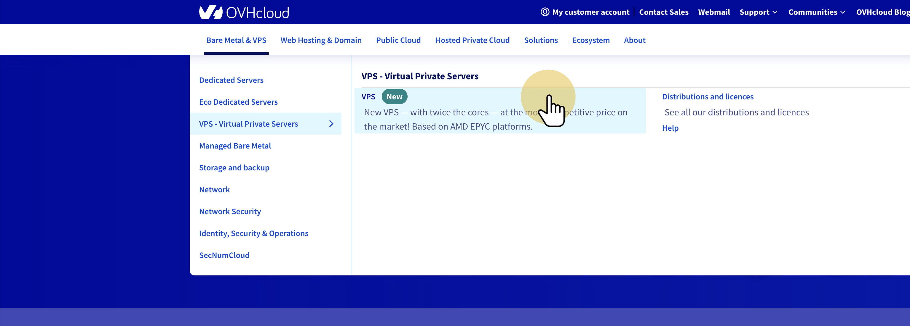
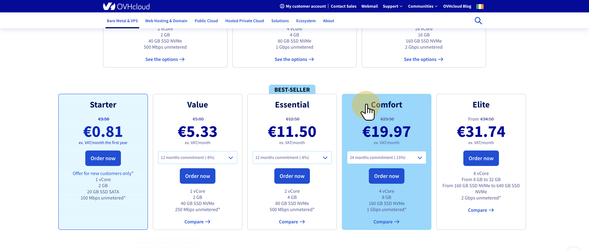
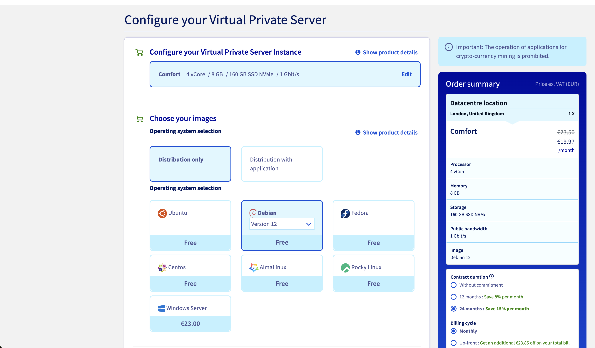
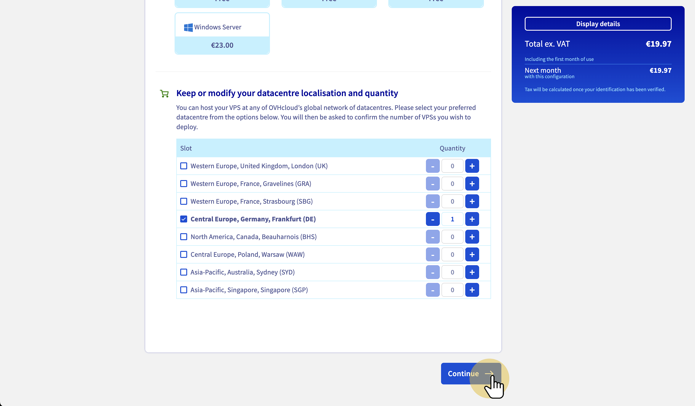
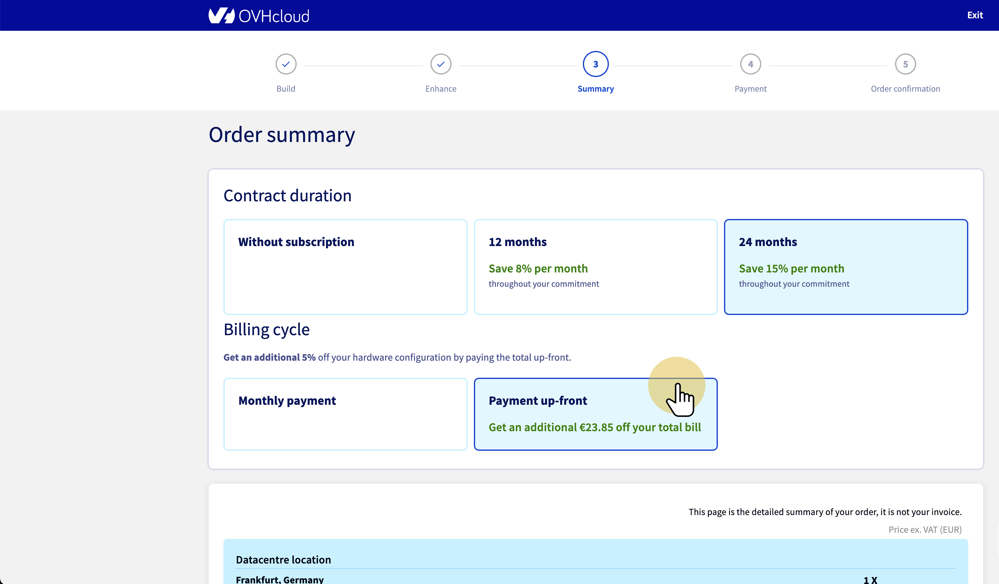
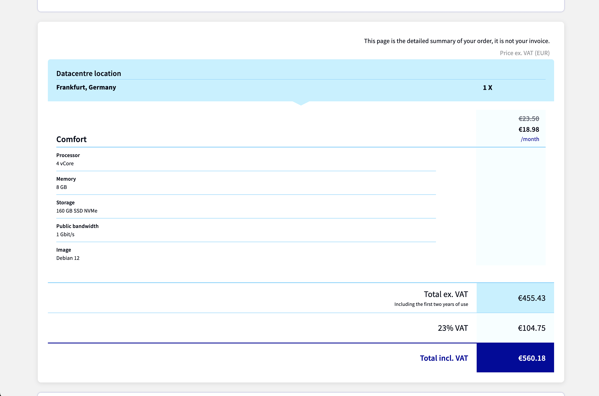

WIP Tezos Octez node setup and baking OVH x softstack x Tezos

This is the documentation for setting up a Tezos Baker/Validator node with a server from [OVH](https://www.ovh.com).

- [1. Prerequisites](#1-prerequisites)
  - [1.1 Hardware Setup](#11-hardware-setup)
  - [1.2 Buy OVH server](#12-buy-ovh-server)
- [2. Hardening the server](#2-hardening-the-server)
  - [2.1 Login to server](#21-login-to-server)
  - [2.2 Create new user with sudo privileges](#22-create-new-user-with-sudo-privileges)

# 1. Prerequisites

## 1.1 Hardware Setup

- High CPU performance for transaction processing
- Sufficient memory to handle blockchain data and operations
- Fast and reliable storage with SSD
- Good network performance

In numbers:

- 8 GB RAM
- 2 CPU cores (better 4 vCPU)
- Min. 256 GB SSD Drive
- Linux (Docker optional)
- Network min. 100 Mbps

History types for a node:

- **Rolling mode:** The most lightweight mode. It stores recent blocks with their current context.
- **Full mode (default mode):** It also stores the content of every block since genesis so that it can handle requests about them, or even recompute the ledger state of every block of the chain.
- **Archive mode:** Also stores the history of the context, allowing services like indexers to enquire about balances or staking rights from any past block.

Network types:

- Mainnet
- Oxfordnet was a testnet. Seems to be deprecated.
- Ghostnet is a permanent testnet for devs or bakers.

The node is intended for baking with no need to store content of every previous block. This is why the history type can be in **rolling** mode. Network type must be **mainnet**.

## 1.2 Buy OVH server

1. Got to [ovh.com](https://www.ovh.com)

- Select *Virtual Private Server*.

2. Choose Comfort Server

- **8GB** RAM
- 4 vCPU
- 160GB SSD NVMe
- 1Gbps network connectivity

3. Configure VPS

- Choose **Debian** as Operating System (Latest Ubuntu 24.04 had a lot of problems).

- Choose datacentre

4. Check order summary

- Select **Payment up-front** to save costs.

5. Complete payment process

# 2. Hardening the server

## 2.1 Login to server

    ssh debian@51.75.73.221

## 2.2 Create new user with sudo privileges

This creates a new user named tezos, sets the password and adds tezos user to sudo group:

    sudo useradd -m -s /bin/bash tezos
    sudo passwd tezos
    sudo usermod -aG sudo tezos

Create a new ssh key locally

    ssh-keygen -t ed25519 -f ~/.ssh/my_custom_key_name -C "comment or label for this key"
