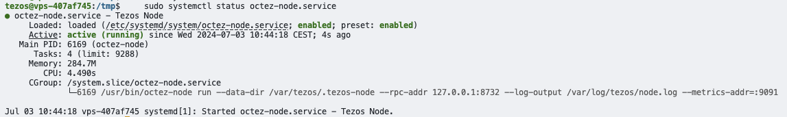
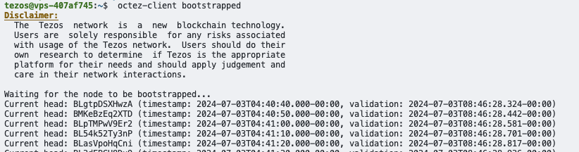

This project guides you through the process of setting up a Tezos validator node on a server from [OVH](https://www.ovh.com). Tezos is a self-amending blockchain network that incorporates a formal, on-chain mechanism for proposing, selecting, testing, and activating protocol upgrades.

A Tezos validator node consists of several key components:

- Tezos Node: The core component that connects to the Tezos network, synchronizes with the blockchain, and processes transactions and blocks.

- Baker: A baker is responsible for creating and signing new blocks. It participates in the consensus mechanism by proposing blocks and validating blocks proposed by other bakers.

- Accuser: The accuser monitors the network for any attempts at double-baking or double-endorsing, which are considered malicious activities. If detected, the accuser reports these actions, potentially resulting in the offending baker losing their stake.

- Validator: In the context of Tezos, a validator combines the functions of a node, baker, and accuser. It fully participates in the network consensus, creates blocks, and helps maintain the integrity of the blockchain.


# 1. Requirements

## 1.1 Hardware Setup

- High CPU performance for transaction processing
- Sufficient memory to handle blockchain data and operations
- Fast and reliable storage with SSD
- Good network performance

In numbers:

- 8 GB RAM
- 2 CPU cores (better 4 vCPU)
- Min. 256 GB SSD Drive
- Linux (Docker optional)
- Network min. 100 Mbps

History types for a node:

- **Rolling mode:** The most lightweight mode. It stores recent blocks with their current context.
- **Full mode (default mode):** It also stores the content of every block since genesis so that it can handle requests about them, or even recompute the ledger state of every block of the chain.
- **Archive mode:** Also stores the history of the context, allowing services like indexers to enquire about balances or staking rights from any past block.

Network types:

- Mainnet
- Parisnet is the current testnet.
- Ghostnet is a permanent testnet for devs or bakers.

The node is intended for baking with no need to store content of every previous block. This is why the history type can be in **rolling** mode. Network type must be **mainnet**.

## 1.2 Buy OVH server

1. Got to [ovh.com](https://www.ovh.com)

- Select _Virtual Private Server_.


2. Choose Comfort Server

- **8GB** RAM
- 4 vCPU
- 160GB SSD NVMe
- 1Gbps network connectivity


3. Configure VPS

- Choose **Debian 12** as Operating System (Latest Ubuntu 24.04 had a lot of problems).


- Choose datacentre


4. Check order summary

- Select **Payment up-front** to save costs.


5. Complete payment process


## 2. Server Setup and Security

### 2.1 Login to server

```bash
ssh debian@server.public.ip.address
```

### 2.2 Create new user with sudo privileges

This creates a new user named tezos, sets the password and adds tezos user to sudo group:

```bash
sudo useradd -m -s /bin/bash tezos
sudo passwd tezos
sudo usermod -aG sudo tezos
```

### 2.3 Disable SSH password Authentication and Use SSH Keys only

The basic rules of hardening SSH are:

- No password for SSH access (use private key)
- Don't allow root to SSH (the appropriate users should SSH in, then su or sudo)
- Use sudo for users so commands are logged
- Log unauthorized login attempts (and consider software to block/ban users who try to access your server too many times, like fail2ban)
- Lock down SSH to only the ip range your require (if you feel like it)

1. Create a new ssh key locally

```bash
ssh-keygen -t ed25519 -f ~/.ssh/my_custom_key_name -C "comment or label for this key"
```

2. Transfer the public key to your remote node. Update keyname.pub appropriately.

```bash
ssh-copy-id -i $HOME/.ssh/keyname.pub debian@server.public.ip.address
```

3. Login with your new user

```bash
ssh tezos@server.public.ip.address
```

4. Disable root login and password based login. 

Edit the /etc/ssh/sshd_config file:

```bash
sudo nano /etc/ssh/sshd_config
```

Update the following lines:

```
ChallengeResponseAuthentication no
PasswordAuthentication no
PermitRootLogin prohibit-password
PermitEmptyPasswords no
```

5. Validate the syntax of your new SSH configuration.

```bash
sudo sshd -t
```

6. If no errors with the syntax validation, restart the SSH process

```bash
sudo systemctl restart sshd
```

### 2.4 Update your system

1. Update and upgrade packages:

```bash
sudo apt update -y && sudo apt dist-upgrade -y
sudo apt autoremove
sudo apt autoclean
```

2. Enable automatic updates:

```bash
sudo apt install unattended-upgrades 
sudo dpkg-reconfigure -plow unattended-upgrades
```

### 2.5 Disable root account

1. To disable the root account:

```bash
sudo passwd -l root
```

2. To re-enable the account if needed:

```bash
sudo passwd -u root
```

### 2.6 Secure Shared Memory

1. Edit /etc/fstab:

```bash
sudo nano /etc/fstab
```

2. Insert the following line to the bottom of the file:

```
tmpfs    /run/shm    tmpfs    ro,noexec,nosuid    0 0
```

3. Reboot the node:

```bash
sudo reboot
```

4. Check the changes:

```bash
mount | grep /run/shm
```

## 2.7 Install Fail2ban
Fail2ban is an intrusion-prevention system that monitors log files and searches for particular patterns that correspond to a failed login attempt. If a certain number of failed logins are detected from a specific IP address (within a specified amount of time), fail2ban blocks access from that IP address.

```bash
sudo apt-get install fail2ban -y
```

Edit a config file that monitors SSH logins.

```bash
sudo nano /etc/fail2ban/jail.local
```

Add the following lines to the bottom of the file.
**Note**: Whitelisting IP address tip: The ignoreip parameter accepts IP addresses, IP ranges or DNS hosts that you can specify to be allowed to connect. This is where you want to specify your local machine, local IP range or local domain, separated by spaces.

```ini
[sshd]
enabled = true
port = 22
filter = sshd
logpath = /var/log/auth.log
maxretry = 3
# whitelisted IP addresses
# ignoreip = <list of whitelisted IP address, your local daily laptop/pc>
```

Save/close file.
Restart fail2ban for settings to take effect.

```bash
sudo systemctl restart fail2ban
```

## 2.8 Configure your Firewall

The standard UFW firewall can be used to control network access to your node. With any new installation, ufw is disabled by default. Enable it with the following settings.

1. Install UFW

```bash
sudo apt install ufw
```

2. Set default policies

```bash
sudo ufw default deny incoming
sudo ufw default allow outgoing
```

3. Allow SSH access (adjust port if you've changed the default SSH port)

```bash
sudo ufw allow ssh
```

4. Allow Tezos node P2P and RPC connections

```bash
sudo ufw allow 9732/tcp  # P2P port for Tezos
sudo ufw allow 8732/tcp  # RPC port for Tezos
```

5. Allow additional ports for monitoring (if needed)

```bash
sudo ufw allow 2020/tcp  # Pyrometer dashboard
sudo ufw allow 9091/tcp  # Metrics port
```

6. Enable firewall

```bash
sudo ufw enable
```

7. Check status

```bash
sudo ufw status verbose
```

8. (Optional) Enable UFW logging

```bash
sudo ufw logging on
```

Note:
- The Tezos node needs port 9732 open for P2P connections to communicate with other nodes.
- Ports 8732 and 8733 are for RPC, which should only be accessible from your IP for security.

Always ensure your firewall rules are as restrictive as possible while still allowing necessary functionality.


## 2.9 Verify Listening Ports

If you want to maintain a secure server, you should validate the listening network ports every once in a while. This will provide you essential information about your network.

```bash
sudo ss -tulpn or sudo netstat -tulpn
```

## 2.10 Time Sync Check

Run the following command:

```bash
timedatectl 
```

✅ Check if NTP Service is active.
✅ Check if Local time, Time zone, and Universal time are all correct.
✅ If NTP Service is not active, run:

```bash
sudo timedatectl set-ntp on 
sudo timedatectl set-ntp true

sudo timedatectl set-timezone Europe/Berlin
```

If you see error message Failed to set ntp: NTP not supported, you may need to install chrony or ntp package.

>**Note** by default, VMs may disable NTP so you may need to find a work-around for your environment.


# 3. Tezos Node Setup

## 3.1 Setup tezos node with Debian

Resources:
- [Tezos Node Setup](https://chrispinnock.com/tezos/node/)

1. Update and install packages

```bash
sudo apt update && sudo apt upgrade
sudo apt install libev4 libhidapi-libusb0 curl net-tools
```

2. Install octez packages

**Important**: Install in this order!

```bash
curl -o octez-node.deb https://pkgbeta.tzinit.org/debian-12/octez-node_20.1-1_amd64.deb
curl -o octez-client.deb https://pkgbeta.tzinit.org/debian-12/octez-client_20.1-1_amd64.deb
curl -o octez-baker.deb https://pkgbeta.tzinit.org/debian-12/octez-baker_20.1-1_amd64.deb

sudo dpkg -i octez-node.deb
sudo dpkg -i octez-client.deb
sudo dpkg -i octez-baker.deb
sudo apt-get install -f

/etc/octez/node.conf

sudo chown -R root:root /var/tezos
sudo mkdir -p /var/log/tezos
sudo chown -R root:root /var/log/tezos
sudo chmod +x /usr/local/bin/octez-node
```

3. Initialise configuration:

```bash
octez-node config init --data-dir /var/tezos/.tezos-node \
    --network=mainnet \
    --history-mode=rolling \
    --net-addr="[::]:9732" \
    --rpc-addr="127.0.0.1:8732" \
    --rpc-addr="0.0.0.0:8733" \
    --connections=20 \
    --metrics-addr="127.0.0.1:9091"
```

If you want to update the configuration use:

```bash
octez-node config update --data-dir ...
```

Show configuration (Editing this manually did break it multiple times):

```bash
cat /var/tezos/.tezos-node/config.json
octez-node config show --config-file /var/tezos/.tezos-node/config.json
```

(Optional, did not work that well) - Allow only allowed peers:

```bash
octez-node config update --data-dir /var/tezos/.tezos-node \
    --peer=<trusted_peer_ip>  \
    --private-mode \
    --external-rpc-add=ADDR:PORT
    --config-file=FILE
```


## 3.2 Get snapshot

Install snapshot

```bash
wget -O /tmp/snap https://snapshots.eu.tzinit.org/mainnet/rolling
octez-node snapshot import /tmp/snap --data-dir /var/tezos/.tezos-node --no-check
```

Output:


If you get an error that the directory is invalid perform this:

```bash
mv /var/tezos/.tezos-node/config.json /tmp/tezos_config_backup.json
rm -rf /var/tezos/.tezos-node/*
mv /tmp/tezos_config_backup.json /var/tezos/.tezos-node/config.json
```

After importing the context from the snapshot delete tmp folder

```bash
rm /tmp/snap
```

## 3.3 Create systemd service for octez node

As root, start the node using systemctl. The enable command will ensure that the node starts on boot.
Since we need to expose the RPC endpoint to the outside add another rpc-addr with `0.0.0.0:8733`.

```bash
sudo nano /etc/systemd/system/octez-node.service
```

```ini
[Unit]
Description=Tezos Node
Wants=network-online.target
After=network-online.target

[Service]
Type=simple
User=root
Group=root
ExecStart=/usr/bin/octez-node run --data-dir /var/tezos/.tezos-node --rpc-addr 0.0.0.0:8733 --rpc-addr 127.0.0.1:8732 --log-output /var/log/tezos/node.log --metrics-addr=127.0.0.1:9091
Restart=on-failure

[Install]
WantedBy=multi-user.target
RequiredBy=tezos-baker.service tezos-accuser.service
```

**NOTE**: To not overwrite the config values instead of this above use flag --config-file /var/tezos/.tezos-node/config.json in ExecStart

After any changes in systemd file, start or restart:

```bash
sudo systemctl daemon-reload
systemctl enable octez-node.service
systemctl start octez-node.service

sudo systemctl restart octez-node.service
```

Check the status of the systemd service:

```bash
sudo systemctl status octez-node.service
```



You can now view the progress of the node in the log file. It will sync with the network and fill the gap from the point that the snapshot was taken to the current block. Then you will have a working Tezos node.

```bash
sudo tail -f /var/log/tezos/node.log
journalctl -f -u octez-node.service -b
```

You can also monitor the progress of the sync with the network using:

```bash
octez-client bootstrapped
```




# 4. Tezos Client Setup

## 4.1 Set base directory and configuration

```bash
sudo mkdir -p /var/tezos/.tezos-client
sudo chown -R $(whoami):$(whoami) /var/tezos/.tezos-client
octez-client --base-dir /var/tezos/.tezos-client config init
octez-client --base-dir /var/tezos/.tezos-client --endpoint http://localhost:8732 config update
octez-client --base-dir /var/tezos/.tezos-client rpc get /chains/main/blocks/head
```


# 5. Tezos Baker Setup Guide

Resources:
- [Run a persistent baker](https://opentezos.com/node-baking/baking/persistent-baker/)
- [Tezos Baker setup](https://chrispinnock.com/tezos/baker/)

This guide provides instructions for setting up a Tezos baker on a Debian-based system using systemd.

## 5.1 Useful commands

List known addresses and show hashes and public key, -S for secret key

```bash
octez-client --endpoint http://<Public-IP>:8733 list known addresses
octez-client --endpoint http://<Public-IP>:8733 show address <alias> -S
```

## 5.2 Creating a Dynamic Baker Start Script

Since the Tezos protocol changes every few months, we need to create a custom script to dynamically fetch the current protocol and start the baker accordingly.

1. Create a new file for the baker start script:

```bash
sudo nano /usr/local/bin/tezos-baker-start
```

2. Add the following content to the file:

```bash
#!/bin/bash

# Get the current protocol
PROTOCOL=$(octez-client rpc get /chains/main/blocks/head/metadata | jq -r .protocol | sed -E 's/^(Pt|Ps)(.{6}).*/\1\2/')

# Start the baker with the current protocol
exec /usr/bin/octez-baker-$PROTOCOL --endpoint http://127.0.0.1:8732 --password-filename /root/.tezos-client/pw run with local node /var/tezos/.tezos-node consensus_key --liquidity-baking-toggle-vote pass
```

3. Make the script executable:

```bash
sudo chmod +x /usr/local/bin/tezos-baker-start
```

## 5.3 Configuring the Baker Service

1. Edit the baker service file:

```bash
sudo nano /etc/systemd/system/octez-baker.service
```

2. Add the following content to the file:

```ini
[Unit]
Description=Tezos baker Service
Documentation=http://tezos.gitlab.io/
After=network-online.target octez-node.service
Wants=network-online.target
Requires=octez-node.service

[Service]
User=root
Group=root
Environment="TEZOS_LOG=* -> debug"
ExecStart=/usr/local/bin/tezos-baker-start
Restart=on-failure

[Install]
WantedBy=multi-user.target
```

## 5.4 Starting and Managing the Baker Service

1. Stop the existing baker service (if running):

```bash
sudo systemctl stop octez-baker.service
```

2. Reload the systemd daemon to recognize the changes:

```bash
sudo systemctl daemon-reload
```

3. Enable the baker service to start on boot:

```bash
sudo systemctl enable octez-baker.service
```

4. Start the baker service:

```bash
sudo systemctl start octez-baker.service
```

5. Restart the baker service (if needed):

```bash
sudo systemctl restart octez-baker.service
```

6. Check the status of the baker service:

```bash
sudo systemctl status octez-baker.service
```
7. To monitor the baker's activity, you can use the following commands:

```bash
journalctl -f -u octez-baker.service -b
```


# 6. Setup Ledger as Remote Signer

## 6.1 Allow local connection

To perform the commands to setup the ledger as remote signer on your local machine, the rpc endpoint must be accessible. 

1. Update node config to allow access to monitoring status to outside via acl filters. (Otherwise this Error will appear: The server doesn't authorize this endpoint (ACL filtering))

```bash
octez-node config update   \
--data-dir /var/tezos/.tezos-node   \
--network=mainnet   \
--history-mode=rolling   \
--net-addr="[::]:9732"   \
--rpc-addr="127.0.0.1:8732"   \
--rpc-addr="0.0.0.0:8733"   \
--connections=20   \
--metrics-addr="127.0.0.1:9091" \
--rpc-acl=[{address="0.0.0.0:8733",blacklist=[]}]
```
2. Allow TCP access to your IP address in Firewall and maybe OVH settings.

3. Check if the node is fully synced

```bash
octez-client bootstrapped
```


## 6.2 Local setup to connect ledger with node on OVH server

### 6.2.1 Install octez client locally (on Mac)

1. Install brew if not already done

```bash
/bin/bash -c "$(curl -fsSL https://raw.githubusercontent.com/Homebrew/install/HEAD/install.sh)"

brew tap serokell/tezos-packaging-stable https://github.com/serokell/tezos-packaging-stable.git

brew install tezos-client
```

2. Verify that the Octez client is installed by running this command:

```bash
octez-client --version
```

3. Check connection with rpc node endpoint. 
```bash
telnet <Public-IP> 8733
curl http://<Public-IP>:8733/chains/main/blocks/head/header
```

4. Try this on the node instance on OVH server to check if node is running:

Returns info about the latest block header:

```bash
octez-client --endpoint http://<Public-IP>:8733 bootstrapped
curl -s http://<Public-IP>:8733/chains/main/blocks/head/header
octez-client --endpoint http://<Public-IP>:8733 rpc get /chains/main/blocks/head/hash
```

Test which ports are listening

```bash
sudo netstat -tulnp | grep LISTEN
sudo netstat -tulnp | grep :8732
sudo netstat -tulnp | grep octez-node
```

5. Configure and set rpc node as endpoint

```bash
octez-client config init
octez-client --endpoint http://<Public-IP>:8733 config update
octez-client config show
```

## 6.2.2 Register as a delegate with the consensus key

**Note**: Always include the "--endpoint http://<Public-IP>:8733" in every `octez-client` command!

Process:

1. Connect and unlock your Ledger to your computer.
2. On Ledger Live

Activate Developer Mode in Experimental Settings. 


Install Tezos Wallet and Tezos Baker app.


3. Open the Tezos wallet app on the device (Must be open for all Ledger operations!)

4. This happens locally: Import consensus key from above kms-consensus-key setup. It's the PublicKey.

```bash
octez-client --endpoint http://<Public-IP>:8733 import public key consensus_key "unencrypted:sppk7..."
```

5. List connected ledgers to get the path

```bash
octez-client --endpoint http://<Public-IP>:8733 list connected ledgers
```

Output looks like this:

```
Found a Tezos Wallet 3.0.4 (git-description:
"stax_1.5.0_3.0.3_sdk_edba017dd479c0adeb115ee1cece6303d03c1610-60-g6e4b8ef1")
application running on Ledger Nano S Plus at [DevSrvsID:4294973661].

To use keys at BIP32 path m/44'/1729'/0'/0' (default Tezos key path), use one
of:
  octez-client import secret key ledger_softstack "ledger://front-chameleon-impossible-horse/ed25519/0h/0h"
  octez-client import secret key ledger_softstack "ledger://front-chameleon-impossible-horse/secp256k1/0h/0h"
  octez-client import secret key ledger_softstack "ledger://front-chameleon-impossible-horse/P-256/0h/0h"
  octez-client import secret key ledger_softstack "ledger://front-chameleon-impossible-horse/bip25519/0h/0h"
```

6. IMPORTANT! Check your tezos wallet address in Ledger Live

Open your account where your tezos funds are and check how the wallet address starts: Either tz1, tz2 or tz3.
Depending on this, choose the correct  command with the right cryptographic signing algorithm.

- **ed25519** for **tz1...** addresses
- **bip25519** for **tz1...** addresses as well. Newer addition to tezos.
- **secp256k1** for **tz2...** addresses: This is less common but still regularly used.
- **P-256** for **tz3...** addresses: This is the least common of the three original address types.

For us, since we had a `tz1...` address we used below command:

```bash
octez-client --endpoint http://<Public-IP>:8733 import secret key ledger_softstack_delegate_key "ledger://front-chameleon-impossible-horse/ed25519/0h/0h"
```

This also imports the secret key with alias `ledger_softstack_delegate_key`. 

7. Validate the public key hash on your connected ledger

8. Register delegate with below command on your computer.

```bash
octez-client --endpoint http://<Public-IP>:8733 \
register key ledger_softstack_delegate_key as delegate \
with consensus key unencrypted:<KMS Consensus Pub Key>
```

This shows that the funds from the connected wallet was used to register as delegate key and the kms consensus key is used for baking processes. 

9. Stake your funds. <AMOUNT> must be at least 6000tz. Keep a few in your wallet for other operations.

```bash
octez-client --endpoint http://<Public-IP>:8733 stake <AMOUNT> for ledger_softstack_delegate_key
```

Now check if the balance of the wallet has these gas fees subtracted with next command: Check funds and baker rights


# 7. Setup Node and Baker restart if they fail

0. Install Postmark

sudo apt-get install python3-pip
pip3 install postmark

1. Create a shell script 

```bash
sudo nano /usr/local/bin/tezos-node-monitor.sh
```

1. Add contents from [Failsafe email script](/docs/files/failsafe_email.sh) script.

2. Make executable

```bash
sudo chmod +x /usr/local/bin/tezos-node-monitor.sh
```

4. Add systemd service

```bash
sudo nano /etc/systemd/system/tezos-monitor.service
```

```ini
[Unit]
Description=Tezos Node Monitor
After=network.target

[Service]
ExecStart=/usr/local/bin/tezos-node-monitor.sh
Restart=always
User=root

[Install]
WantedBy=multi-user.target
```

5. Reload systemd, enable and start the service:

```bash
sudo systemctl daemon-reload
sudo systemctl enable tezos-monitor.service
sudo systemctl start tezos-monitor.service
```

Restart service

```bash
sudo systemctl restart tezos-monitor.service
```

See status and logs:

```bash
sudo systemctl status tezos-monitor.service
journalctl -f -u tezos-monitor.service -b
tail -f /var/log/tezos-monitor.log
```


# 8. Setup accuser

The accuser detects that a baker does not create two competing blocks at the same level nor attest multiple blocks. If an accusation is correct, the accuser gets part of the bakers reward.

1. Create a new file for the accuser start script:

```bash
sudo nano /usr/local/bin/tezos-accuser-start
```

2. Add the following content to the file:

```bash
#!/bin/bash

# Get the current protocol
PROTOCOL=$(octez-client rpc get /chains/main/blocks/head/metadata | jq -r .protocol | sed -E 's/^(Pt|Ps)(.{6}).*/\1\2/')

# Start the accuser with the current protocol
exec /usr/bin/octez-accuser-$PROTOCOL --endpoint http://127.0.0.1:8732 run
```

3. Make the script executable:

```bash
sudo chmod +x /usr/local/bin/tezos-accuser-start
```

## 8.1 Configuring the Accuser Service

4. Create the accuser service file:

```bash
sudo nano /etc/systemd/system/octez-accuser.service
```

5. Add the following content to the file:

```ini
[Unit]
Description=Tezos Accuser Service
Documentation=http://tezos.gitlab.io/
After=network-online.target octez-node.service
Wants=network-online.target
Requires=octez-node.service

[Service]
User=root
Group=root
Environment="TEZOS_LOG=* -> debug"
ExecStart=/usr/local/bin/tezos-accuser-start
Restart=on-failure

[Install]
WantedBy=multi-user.target
```

## 8.2 Starting and Managing the Accuser Service

6. Reload the systemd daemon to recognize the new service:

```bash
sudo systemctl daemon-reload
```

7. Enable the accuser service to start on boot:

```bash
sudo systemctl enable octez-accuser.service
```

8. Start the accuser service:

```bash
sudo systemctl start octez-accuser.service
```

9. Check the status of the accuser service:

```bash
sudo systemctl status octez-accuser.service
```

10. If you need to restart the accuser service:

```bash
sudo systemctl restart octez-accuser.service
```

11. To view the accuser logs:

```bash
journalctl -f -u octez-accuser.service
```


# 9. Monitoring

## 9.1 Option 1: Using cli commands for monitoring

Get PID for processes

```bash
pgrep -f octez-node
9218 
9243 (validator)
16736 baker
```

```bash
pidstat -u -r -p 9218,9243,16736 60 > /var/log/log_all_octez_instances.csv &
16795
```

Track network every min

```bash
sar -n DEV 60 1 > /var/log/sar_network.csv &
nohup sar -n DEV 60 > /var/log/network_usage.log 2>&1 &
10136
```

Results:
    This usage is relatively low.
    89.52 KB/s received ≈ 0.7 Mbps
    54.91 KB/s sent ≈ 0.4 Mbps


Run in batch mode for continuous tracking (run every min)

```bash
glances --export csv --export-csv-file /var/log/glances.csv -B 60 --disable-plugin load,help,diskio,fs &
15787
```


See background jobs

```bash
jobs
kill <PID>
```

Find packages:

```bash
which octez-client
```

### 9.1.1 Monitoring results

Octez node on average uses 60% (2.3Gi) of Memory(4Gi)... If the baker gets added this may not be enough.

CPU Usage:

- The octez-node process (PID 9218) consistently uses between 7.82% and 10.68% CPU, with slight variations over time.

- The second octez-node process (PID 9243) uses significantly less CPU, ranging from 0.70% to 2.32%.

- The octez-baker-PtP process (PID 16736) uses between 0.78% and 1.08% CPU.

Memory Usage:

- The octez-node process (PID 9218) has a consistent memory usage of around 26.44% of total memory.
  
- The second octez-node process (PID 9243) uses around 23.35% of memory.

- The octez-baker-PtP process (PID 16736) uses about 5.35% of memory, with a slight increase to 5.37% towards the end.

## 9.2 Tezos node monitoring with Pyrometer

### 9.2.1 Install pyrometer

Resources: 
- [Pyrometer Gitlab Steps](https://gitlab.com/tezos-kiln/pyrometer)


Install node

```bash
apt-get install -y curl
curl -fsSL https://deb.nodesource.com/setup_22.x -o nodesource_setup.sh
bash nodesource_setup.sh
apt-get install -y nodejs
node -v
```

Download latest .deb from [Pyrometer releases](https://gitlab.com/tezos-kiln/pyrometer/-/releases). Rename version accordingly

```bash
wget -O pyrometer_0.10.1_all.deb https://gitlab.com/tezos-kiln/pyrometer/-/package_files/134721719/download
sudo dpkg -i pyrometer_0.10.1_all.deb
```

Edit pyrometer settings in `/etc/pyrometer.toml`

```bash
sudo nano /etc/pyrometer.toml
```

Add these settings:

```toml
[baker_monitor]
bakers = ["tz1..."]
rpc = "http://localhost:8732"

[node_monitor]
nodes = [  "http://127.0.0.1:8732" ]

[ui]
show_system_info = true

[email]
enabled = true
host = "smtp.postmarkapp.com"
port = 587
protocol = "PLAIN"
to = [ "MY_EMAIL" ]
from = "Tezos Node Pyrometer <EMAIL_DOMAIN>"
username = "<POSTMARK API TOKEN>"
password = "<POSTMARK API TOKEN>"
emoji = true
short_address = true
exclude = [ ]
```

If you want to get email notifications create an account at [postmark](https://postmarkapp.com/) and put in the <POSTMARK API TOKEN> for both username and password.

The systemd for pyrometer can be found in `/lib/systemd/system/pyrometer.service`

After editing the pyrometer.toml, restart and check logs

```bash
sudo systemctl restart pyrometer
journalctl -u pyrometer -f
```


### 9.2.1 Pyrometer notifications event types

    🤒 baker unhealthy
    baker missed baker_monitor:missed_threshold events in a row

    💪 baker recovered
    baker successfully baked or endorsed after being unhealthy

    😡 missed bake
    baker was scheduled to produce a block at this level, but failed to
    do so

    😾 missed baking bonus
    baker proposed a block payload, but failed to actually produce the
    block itself, another baker did that and received the bonus

    🥖 baked
    baker produced a block as scheduled per baking rights

    ✂️️️️ double baked
    baker produced two different blocks in the same round, baker's
    deposit will be slashed as punishment

    😕 missed endorsement
    baker missed an endosement

    ‼️️ double endorsed
    baker endorsed two different blocks in the same round

    ‼️️ double pre-endorsed
    baker pre-endorsed two different blocks in the same round

    🐌 node behind
    a monitored node is not synchronized with the blockchain, is at a
    lower block level then the other nodes in the network

    💫 node synced
    a monitored node has caught up with the blockchain after falling behind

    🤔 low peers
    a monitored node has fewer than node_monitor:low_peer_count
    peers

    🤝 low peers resolved
    a monitored node connected to a sufficient number of
    node_monitor:low_peer_count peers

    😴 deactivated
    baker has been deactivated

    😪 deactivation risk
    baker is at risk of deactivation (baker stopped participating and
    will be deactivated once previously calculated baking right run out)

    ⚠️ rpc error
    an error occurred while communicating with Tezos node RPC interface


### 9.2.2 Pyrometer dashboard

Visit `http://<Public-IP>:2020` to see the Pyrometer dashboard.

### 9.2.3 Other monitoring tools

Grafana prometheus with a premade dashboard : [https://gitlab.com/nomadic-labs/grafazos](https://gitlab.com/nomadic-labs/grafazos)

# 10. Maintenance 

## 10.1 Regular System Maintenance

1. Update Debian OS:
   - Run `sudo apt update && sudo apt upgrade` at least monthly.
   - Reboot the system after significant updates.

2. Monitor and manage disk space:
   - Regularly check available disk space with `df -h`.
   - Set up log rotation for Tezos node logs if not already configured.
   - Consider pruning old blockchain data if using full or archive node modes.

3. Check system resource usage:
   - Monitor CPU, RAM, and network usage periodically.
   - Use tools like `top`, `htop`, or your configured monitoring solution.

## 10.2 Tezos-specific Maintenance

4. Update Tezos software:
   - Check for new Tezos releases every 1-2 months.
   - Update octez-node, octez-client, and octez-baker when new versions are available.
   - Test updates on a testnet node before applying to mainnet.

5. Monitor Tezos protocol upgrades:
   - Stay informed about upcoming protocol upgrades (every few months).
   - Ensure your node is compatible with new protocols before they activate.
   - Update your baker and accuser scripts to use the new protocol after activation.

6. Check node synchronization:
   - Regularly verify that your node is fully synced with the network.
   - Use `octez-client bootstrapped` to check sync status.

7. Monitor baking and endorsing performance:
   - Regularly check if you're missing any baking or endorsing slots.
   - Investigate and resolve any missed opportunities promptly.

8. Review and optimize baker configuration:
   - Periodically review your baker settings for optimal performance.
   - Adjust liquidity baking strategy if needed.

## 10.3 Security Maintenance

9. Update firewall rules:
   - Ensure only necessary ports are open.

10. Rotate access keys and update passwords:
    - Regularly update SSH keys used to access the server.
    - If using password authentication anywhere, change passwords periodically.

11. Review system logs:
    - Check for any suspicious activities or error patterns in system logs.
    - Pay special attention to authentication logs (`/var/log/auth.log`).

12. Update SSL certificates:
    - If using SSL for RPC endpoints, ensure certificates are renewed before expiry.

## 10.4 Monitoring and Alerting

13. Check and update monitoring tools:
    - Ensure Pyrometer or other monitoring solutions are up-to-date and functioning.
    - Review and adjust alert thresholds if necessary.

14. Test alerting system:
    - Periodically test that your alerting system (email, SMS, etc.) is working correctly.

## 10.5 Backup and Recovery

15. Perform regular backups:
    - Backup important configuration files and keys.
    - Consider periodic snapshots of the whole server.

16. Test recovery procedures:
    - Occasionally test restoring from backups to ensure they're valid and the process works.

## 10.6 Network and Performance Optimization

17. Review and optimize network connections:
    - Check the number and quality of peer connections.
    - Optimize if necessary for better network performance.

18. Perform periodic performance tuning:
    - Review and adjust system parameters for optimal Tezos node performance.
    - This might include tweaking open file limits, network buffer sizes, etc.

## 10.7 Documentation and Knowledge Base

19. Update documentation:
    - Keep your setup and maintenance documentation up-to-date.
    - Document any changes made during maintenance for future reference.

20. Stay informed:
    - Follow Tezos community updates, forums, and official announcements.
    - Participate in discussions about network upgrades and best practices.

## 10.8 Financial and Regulatory Compliance

21. Review staking rewards and costs:
    - Periodically review your baking rewards and associated costs.
    - Adjust your strategy if necessary for optimal returns.

22. Stay compliant with regulations:
    - Keep abreast of any regulatory changes affecting cryptocurrency staking in your jurisdiction.
    - Ensure compliance with tax reporting requirements for staking rewards.

Implement a routine schedule for these maintenance tasks, with some performed weekly, others monthly, and some quarterly or bi-annually as appropriate. Regular maintenance will help ensure the longevity, security, and efficiency of your Tezos validator node.

# Congratulations

You have successfully setup your Tezos validator node on OVH server.

If any questions arise feel free to contact us at [softstack.io](https://softstack.io/).
